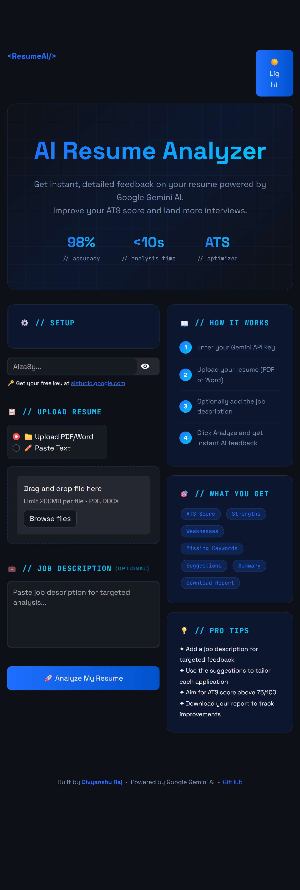

# ResumeAI — AI Resume Analyzer 🎯

An AI-powered resume analyzer built with Python, Streamlit, and Google Gemini AI. Get instant, detailed feedback on your resume with ATS scoring, strengths, weaknesses, and actionable suggestions.

## Live Demo 🌐
[Coming soon — deploying on Streamlit Cloud]

## Screenshots

## Features ✨

- 📊 **ATS Score** — Get a score out of 100
- ✅ **Strengths** — What's working well in your resume
- ⚠️ **Weaknesses** — Areas that need improvement
- 🎯 **Missing Keywords** — Keywords missing for specific job descriptions
- 💡 **Suggestions** — 5 actionable improvements
- 🌓 **Dark/Light Theme** — Toggle between themes
- 📁 **PDF & Word Support** — Upload any resume format
- ⬇️ **Download Report** — Save your analysis

## Tech Stack 🛠️

- **Python** — Core language
- **Streamlit** — Web UI framework
- **Google Gemini AI** — AI analysis engine
- **PyPDF2** — PDF reading
- **python-docx** — Word document reading

## How to Run Locally 🚀

1. Clone the repo:

git clone https://github.com/divyanshu1213/ai-resume-analyzer
cd ai-resume-analyzer

2. Install dependencies:

pip install streamlit google-genai PyPDF2 python-docx

3. Run the app:
streamlit run app.py

4. Open browser at `http://localhost:8501`

## How to Use

1. Get a free Gemini API key from [aistudio.google.com](https://aistudio.google.com)
2. Enter your API key in the Setup section
3. Upload your resume (PDF or Word)
4. Optionally paste a job description for targeted feedback
5. Click **Analyze My Resume**
6. Download your report!

## About

Built by **Divyanshu Raj** — CS Engineer | Deep Learning | Python | Azure

- 🌐 [Portfolio](https://divyanshu1213.github.io)
- 💼 [LinkedIn](https://www.linkedin.com/in/divyanshu-raj-0a2498275)
- 🐙 [GitHub](https://github.com/divyanshu1213)